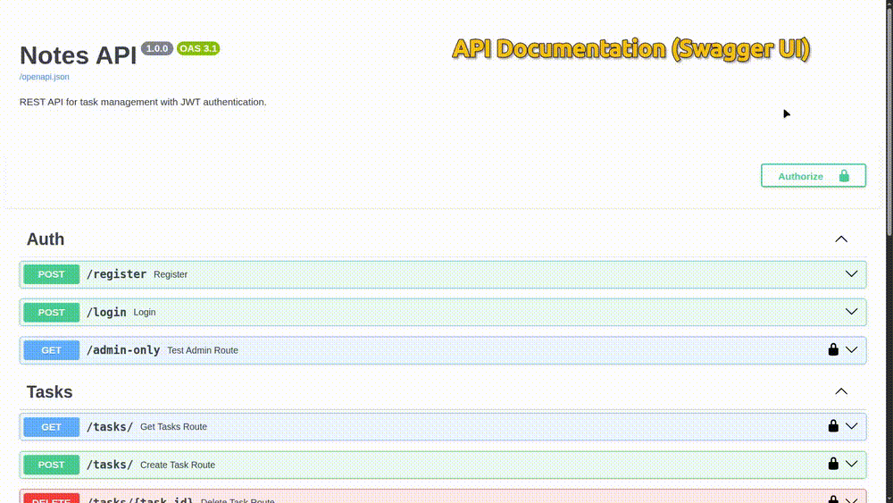

# Notes API



A REST API for managing notes/tasks with authentication, authorization, and user-based access control.

Built with **FastAPI** following clean backend practices, including service-layer separation, JWT authentication, database integration, automated tests, and API documentation with Swagger UI.

---

## 🚀 Features

* User registration
* User authentication with JWT
* Protected API endpoints
* Task CRUD operations
* User ownership permissions
* Admin role support
* Pagination and filtering
* Automated API tests
* Interactive Swagger documentation

---

## 🛠️ Tech Stack

* **Python 3.12**
* **FastAPI**
* **SQLAlchemy 2.0**
* **Pydantic v2**
* **SQLite**
* **JWT Authentication**
* **Passlib / Bcrypt**
* **Pytest**
* **Ruff**
* **Black**

---

## 📂 Project Structure

```
.
├── dependencies/
│   └── security.py
│
├── routes/
│   ├── auth_routes.py
│   └── task_routes.py
│
├── services/
│   ├── auth_service.py
│   └── task_service.py
│
├── tests/
│   ├── conftest.py
│   ├── test_auth.py
│   └── test_tasks.py
│
├── core/
│   └── config.py
│
├── database.py
├── models.py
├── schemas.py
├── auth.py
├── main.py
└── requirements.txt
```

---

## 🔐 Authentication Flow

The API uses JWT tokens to protect private routes.

Flow:

```
Register user
      ↓
Login
      ↓
Receive JWT token
      ↓
Authorize requests
      ↓
Access protected endpoints
```

Authentication is handled through the `Authorization` header:

```
Authorization: Bearer <token>
```

---

## 📌 API Endpoints

### Authentication

| Method | Endpoint         | Description                       |
| ------ | ---------------- | --------------------------------- |
| POST   | `/auth/register` | Create a new user                 |
| POST   | `/auth/login`    | Authenticate user and receive JWT |

---

### Tasks

| Method | Endpoint           | Description     |
| ------ | ------------------ | --------------- |
| GET    | `/tasks/`          | List user tasks |
| POST   | `/tasks/`          | Create a task   |
| PUT    | `/tasks/{task_id}` | Update a task   |
| DELETE | `/tasks/{task_id}` | Delete a task   |

---

## 🔒 Authorization Rules

Users can only manage their own tasks.

Examples:

* User A creates a task
* User B tries to update or delete it
* API denies the request with `403 Forbidden`

Admins have elevated permissions and can access resources according to their role.

---

## 🧪 Running Tests

Install dependencies:

```bash
pip install -r requirements.txt
```

Run the test suite:

```bash
pytest
```

Example result:

```
6 passed
```

---

## ▶️ Running Locally

Clone the repository:

```bash
git clone <repository-url>
```

Create a virtual environment:

```bash
python -m venv venv
```

Activate it:

Linux/macOS:

```bash
source venv/bin/activate
```

Install dependencies:

```bash
pip install -r requirements.txt
```

Create your environment file:

```bash
cp .env.example .env
```

Start the API:

```bash
uvicorn main:app --reload
```

The API will be available at:

```
http://localhost:8000
```

Swagger documentation:

```
http://localhost:8000/docs
```

---

## Environment Variables

Create a `.env` file based on `.env.example`:

```env
SECRET_KEY=your_secret_key_here
ALGORITHM=HS256
DATABASE_URL=sqlite:///./sql_app.db

## ⚙️ Code Quality

This project uses:

### Black

Automatic code formatting:

```bash
black .
```
---

### Ruff

Linting and code quality checks:

```bash
ruff check .
```

The project follows consistent formatting, clean imports, and modern Python typing practices.

---

## 📖 API Documentation

FastAPI automatically generates interactive documentation using Swagger UI.

Available at:

```
/docs
```

The documentation allows testing authenticated requests directly through the browser.

---

## 🎯 Project Goals

This project was built to practice and demonstrate:

* Backend API development
* Authentication and authorization
* Database modeling
* Layered architecture
* Testing REST APIs
* Production-oriented Python practices

---

## 📄 License

This project is available for learning and portfolio purposes.

